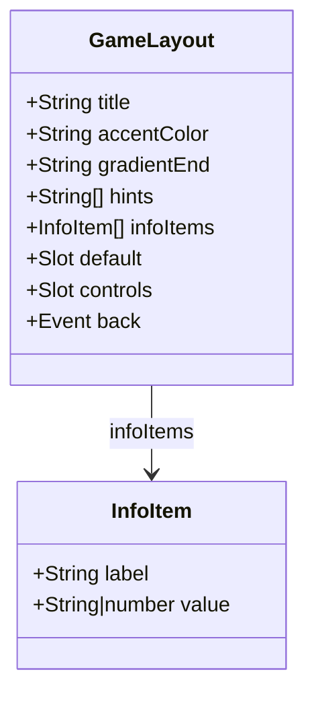
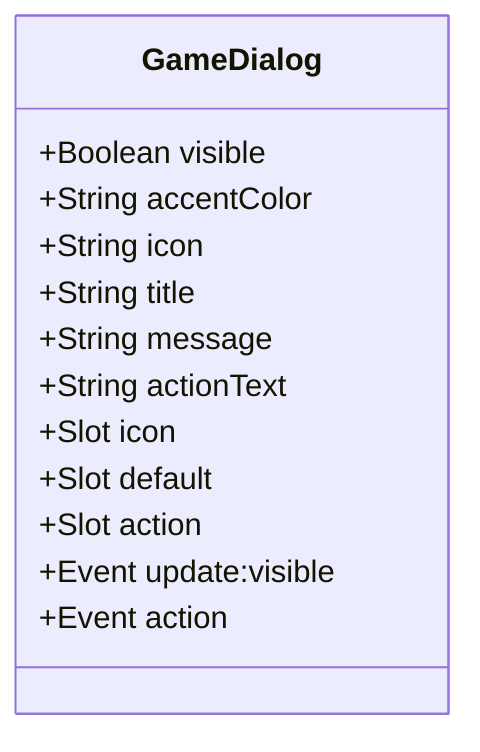
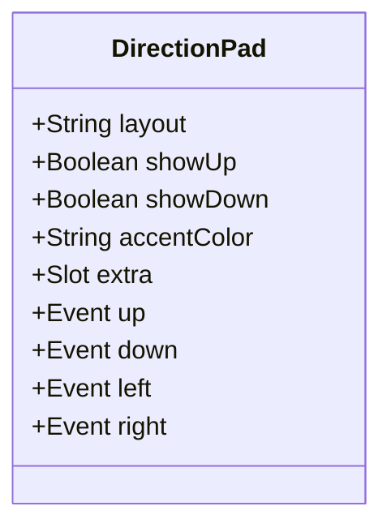
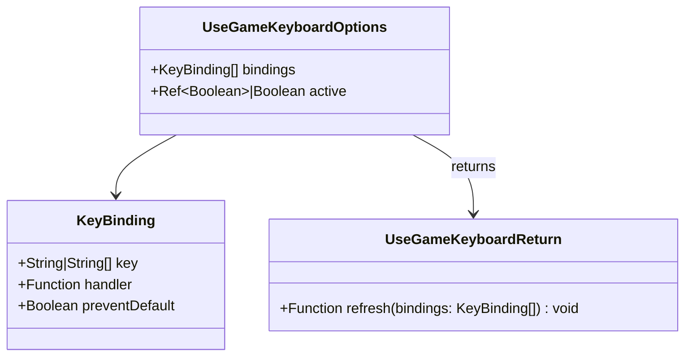
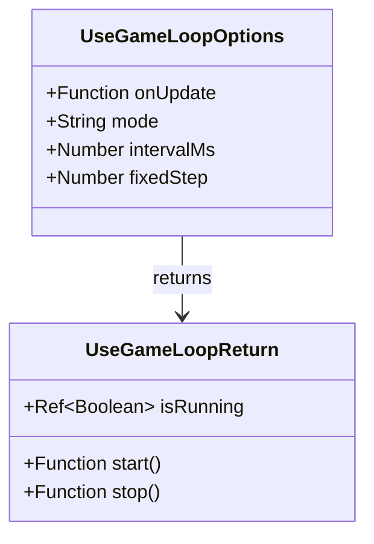
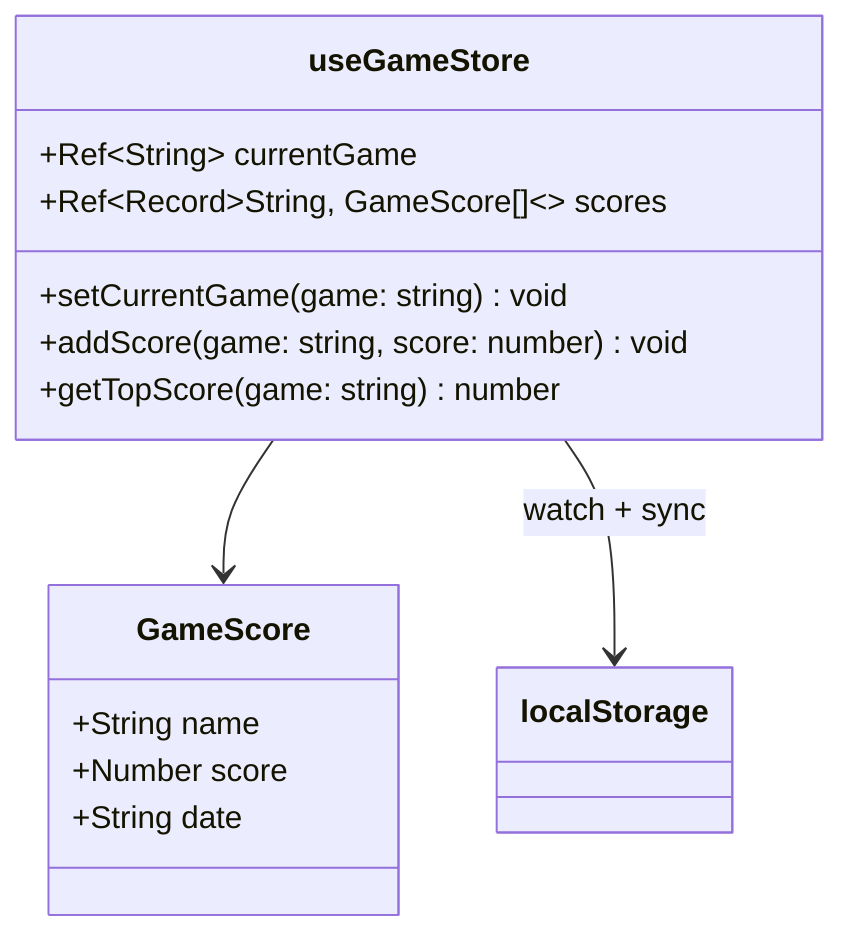
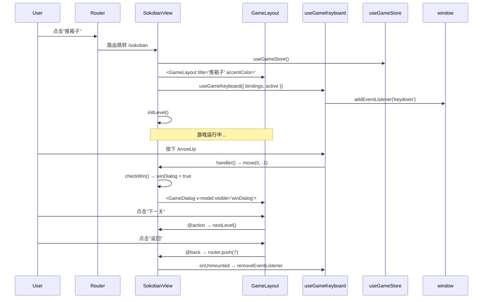
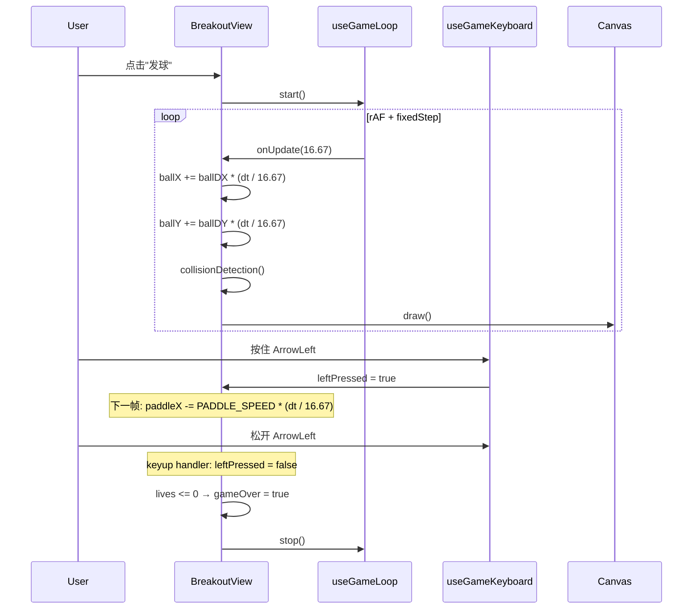
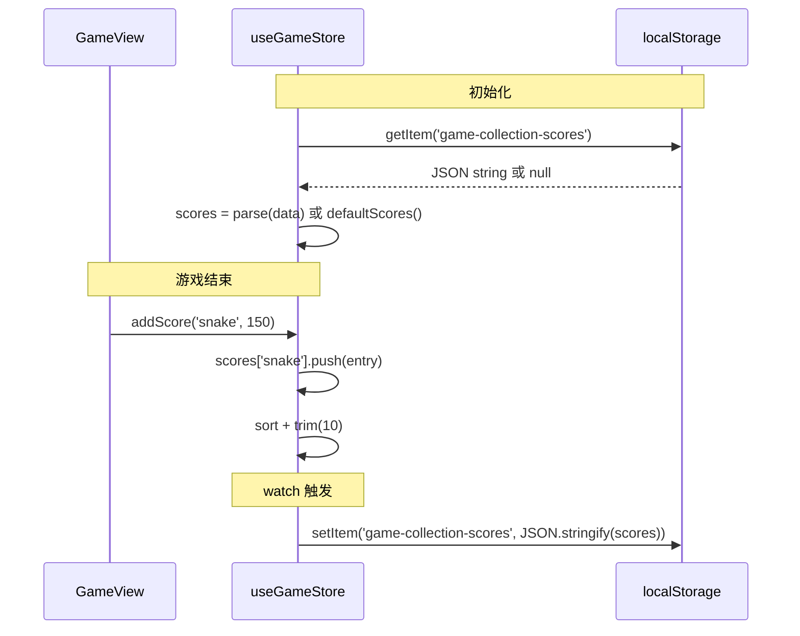
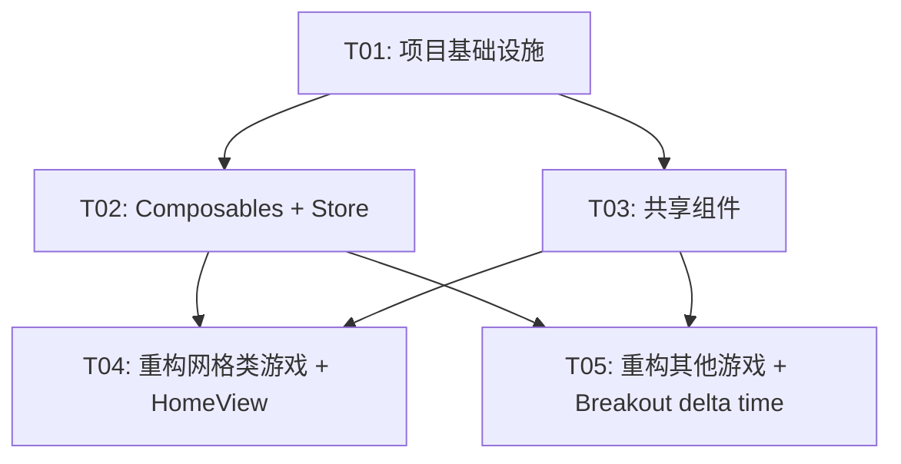

# Game Collection 架构重构设计

## Part A: 系统设计

---

### 1. 实现方法

#### 核心技术挑战

1. **~60% CSS 重复**：6 个游戏视图复制了 `.game-view`、`.scanlines`、`.game-header`、`.back-btn`、`.game-info`、`.keyboard-hint`、`.dialog-overlay`、`.dialog`、`.controls` 等全套样式。解法：提取 `GameLayout` / `GameDialog` / `DirectionPad` 三个共享组件 + `game-theme.css` CSS 变量文件。

2. **无共享 Composable**：键盘绑定、游戏循环、生命周期清理在每个游戏中各写一遍。解法：提取 `useGameKeyboard` 和 `useGameLoop` 两个 composable。

3. **Breakout rAF 无 delta time**：球速依赖帧率，高刷屏下球速过快。解法：`useGameLoop` 提供基于时间的步进，Breakout 改用固定时间步进（fixedStep）。

4. **Element Plus 未使用**：引入但零调用，增加 ~700KB 包体积。解法：直接移除。

5. **Store 无持久化**：刷新丢分。解法：Pinia store 内 `watch` + `localStorage`。

6. **createWebHistory 静态部署不友好**：需服务器 fallback。解法：改用 `createWebHashHistory`。

#### 框架和库选择

- 不新增任何第三方依赖
- Pinia store 持久化使用手动 `watch` + `localStorage`（无需 `pinia-plugin-persistedstate`）
- 组件设计使用 Vue 3 `<script setup>` + TypeScript

#### 架构模式

保持 Vue 3 SPA 单页应用架构不变，重构聚焦于：
- **组件抽取**：共享 UI → 独立 `.vue` 组件
- **逻辑抽取**：共享逻辑 → composable
- **样式统一**：CSS 变量 + 共享组件 scoped style

---

### 2. 文件列表

```
src/
├── main.ts                              # 修改：移除 Element Plus
├── App.vue                              # 修改：scanlines 移至此处
├── router/index.ts                      # 修改：createWebHashHistory
├── styles/
│   └── game-theme.css                   # 新增：CSS 变量定义
├── components/
│   ├── GameLayout.vue                   # 新增：游戏布局壳
│   ├── GameDialog.vue                   # 新增：游戏弹窗
│   └── DirectionPad.vue                 # 新增：方向控制器
├── composables/
│   ├── useGameKeyboard.ts               # 新增：键盘绑定
│   └── useGameLoop.ts                   # 新增：游戏循环
├── stores/
│   └── game.ts                          # 修改：localStorage 持久化
└── views/
    ├── HomeView.vue                     # 修改：移除 scanlines
    ├── SokobanView.vue                  # 修改：使用共享组件
    ├── LinkGameView.vue                 # 修改：使用共享组件
    ├── SnakeView.vue                    # 修改：使用共享组件
    ├── CatchFruitView.vue               # 修改：使用共享组件
    ├── TetrisView.vue                   # 修改：使用共享组件
    └── BreakoutView.vue                 # 修改：使用共享组件 + delta time
```

---

### 3. 数据结构与接口

#### 3.1 GameLayout 组件



**Props：**

| Prop | 类型 | 必填 | 默认值 | 说明 |
|------|------|------|--------|------|
| `title` | `string` | ✅ | — | 游戏标题，显示在 header 中间 |
| `accentColor` | `string` | ✅ | — | 主题色，影响标题渐变终点、边框发光、按钮 hover 等 |
| `gradientEnd` | `string` | ❌ | `accentColor` | 标题渐变起点色（从 gradientEnd 到 accentColor） |
| `hints` | `string[]` | ❌ | `[]` | 键盘提示文字数组 |
| `infoItems` | `InfoItem[]` | ❌ | `[]` | 右侧信息项 |

**Slots：**

| Slot | 说明 |
|------|------|
| `default` | 游戏内容区（棋盘、Canvas 等） |
| `controls` | 控制按钮区，放置 DirectionPad 或自定义按钮 |

**Events：**

| Event | Payload | 说明 |
|-------|---------|------|
| `back` | — | 点击返回按钮时触发 |

**模板结构：**

```html
<div class="game-view" :style="{ '--game-accent': accentColor }">
  <div class="game-header">
    <button class="back-btn" @click="$emit('back')">
      ← 返回
    </button>
    <h2>{{ title }}</h2>
    <div class="game-info">
      <span v-for="item in infoItems">{{ item.label }} {{ item.value }}</span>
    </div>
  </div>
  <div class="keyboard-hint" v-if="hints.length">
    <span v-for="hint in hints">{{ hint }}</span>
  </div>
  <div class="game-container">
    <slot></slot>
  </div>
  <div class="controls-area" v-if="$slots.controls">
    <slot name="controls"></slot>
  </div>
</div>
```

**样式要点：**
- `.game-view` 使用 `--game-accent` CSS 变量驱动所有颜色
- 标题渐变：`background: linear-gradient(135deg, var(--game-accent), var(--gradient-end, var(--game-accent)))`
- 按钮边框 hover：`border-color: var(--game-accent)`
- 游戏面板边框：`border: 1px solid color-mix(in srgb, var(--game-accent) 20%, transparent)`

---

#### 3.2 GameDialog 组件



**Props：**

| Prop | 类型 | 必填 | 默认值 | 说明 |
|------|------|------|--------|------|
| `visible` | `boolean` | ✅ | — | v-model 控制显示隐藏 |
| `accentColor` | `string` | ❌ | `'#00FFFF'` | 主题色，影响按钮渐变、边框发光 |
| `icon` | `'success' \| 'fail' \| 'info'` | ❌ | — | 预设图标类型 |
| `title` | `string` | ✅ | — | 弹窗标题 |
| `message` | `string` | ❌ | `''` | 描述文字 |
| `actionText` | `string` | ❌ | `'确定'` | 操作按钮文字 |

**Slots：**

| Slot | 说明 |
|------|------|
| `icon` | 自定义图标区域（优先级高于 icon prop） |
| `default` | 自定义内容（优先级高于 message prop） |
| `action` | 自定义操作按钮（优先级高于 actionText prop） |

**Events：**

| Event | Payload | 说明 |
|-------|---------|------|
| `update:visible` | `boolean` | v-model 双向绑定 |
| `action` | — | 点击操作按钮时触发 |

**预设图标映射：**

| icon 值 | SVG | 颜色 |
|---------|-----|------|
| `success` | 星星（⭐） | `#00FFFF` |
| `fail` | 圆形感叹号 | `#B967FF` |
| `info` | 圆形 i | `#818CF8` |

**使用示例：**

```vue
<!-- 简单模式 -->
<GameDialog
  v-model:visible="gameOver"
  icon="fail"
  title="游戏结束"
  :message="`得分: ${score}`"
  action-text="再来一局"
  accent-color="#B967FF"
  @action="startGame"
/>

<!-- 自定义模式 -->
<GameDialog v-model:visible="winDialog" accent-color="#00FFFF">
  <template #icon>
    <svg><!-- 自定义星星 --></svg>
  </template>
  <template #default>
    <h3>恭喜过关！</h3>
    <p>用了 {{ steps }} 步</p>
  </template>
  <template #action>
    <button @click="nextLevel">下一关</button>
  </template>
</GameDialog>
```

---

#### 3.3 DirectionPad 组件



**Props：**

| Prop | 类型 | 必填 | 默认值 | 说明 |
|------|------|------|--------|------|
| `layout` | `'cross' \| 'horizontal'` | ❌ | `'cross'` | 布局模式：cross=十字方向键，horizontal=左右横排 |
| `showUp` | `boolean` | ❌ | `true` | 是否显示上键（horizontal 模式忽略） |
| `showDown` | `boolean` | ❌ | `true` | 是否显示下键（horizontal 模式忽略） |
| `accentColor` | `string` | ❌ | — | 覆盖主题色（不传则继承 GameLayout 的 --game-accent） |

**Slots：**

| Slot | 说明 |
|------|------|
| `extra` | 额外按钮区域（如重置、下一关、开始等） |

**Events：**

| Event | Payload | 说明 |
|-------|---------|------|
| `up` | — | 点击上键 |
| `down` | — | 点击下键 |
| `left` | — | 点击左键 |
| `right` | — | 点击右键 |

**布局示意：**

```
cross 模式：                horizontal 模式：
      [↑]                  [←]  [中间slot]  [→]
  [←] [↓] [→]
  [---extra---]
```

---

#### 3.4 useGameKeyboard Composable



**接口定义：**

```ts
interface KeyBinding {
  key: string | string[]           // 键名或键名数组
  handler: (e: KeyboardEvent) => void
  preventDefault?: boolean         // 是否阻止默认行为（默认 true）
}

interface UseGameKeyboardOptions {
  bindings: KeyBinding[]
  active?: Ref<boolean> | boolean  // 是否激活，false 时不监听
}

function useGameKeyboard(options: UseGameKeyboardOptions): {
  refresh: (bindings: KeyBinding[]) => void  // 运行时更新绑定
}
```

**行为：**
- `onMounted` 自动 `addEventListener('keydown', ...)`
- `onUnmounted` 自动 `removeEventListener`
- 当 `active` 为 `false` 时，事件处理器提前 return（不移除 listener，避免反复 add/remove）
- `preventDefault` 对 `ArrowUp/Down/Left/Right` 和 `Space` 默认为 `true`

**使用示例（Sokoban）：**

```ts
const { refresh } = useGameKeyboard({
  bindings: [
    { key: ['ArrowUp', 'w', 'W'], handler: () => move(0, -1) },
    { key: ['ArrowDown', 's', 'S'], handler: () => move(0, 1) },
    { key: ['ArrowLeft', 'a', 'A'], handler: () => move(-1, 0) },
    { key: ['ArrowRight', 'd', 'D'], handler: () => move(1, 0) },
    { key: ['r', 'R'], handler: resetLevel },
    { key: ['Enter', ' '], handler: nextLevel },
  ],
  active: computed(() => !winDialog.value),
})
```

**使用示例（Breakout，需要 keydown + keyup）：**

```ts
// Breakout 不用此 composable 的 keyup 场景
// 仅 keydown 部分使用 useGameKeyboard
// keyup（leftPressed/rightPressed）仍手动绑定
useGameKeyboard({
  bindings: [
    { key: ['ArrowLeft', 'a', 'A'], handler: () => { leftPressed = true } },
    { key: ['ArrowRight', 'd', 'D'], handler: () => { rightPressed = true } },
    { key: 'Enter', handler: launchBall },
    { key: ['p', 'P'], handler: () => { paused.value = !paused.value } },
  ],
  active: computed(() => !gameOver.value && !victory.value),
})
// keyup 仍需手动处理（Breakout 特殊需求，保留在组件内）
onMounted(() => window.addEventListener('keyup', handleKeyup))
onUnmounted(() => window.removeEventListener('keyup', handleKeyup))
```

---

#### 3.5 useGameLoop Composable



**接口定义：**

```ts
type LoopMode = 'raf' | 'interval'

interface UseGameLoopOptions {
  onUpdate: (deltaTime: number) => void   // deltaTime 单位 ms
  mode?: LoopMode                          // 默认 'interval'
  intervalMs?: number                      // interval 模式间隔（默认 150ms）
  fixedStep?: number                       // rAF 模式固定步进（ms），0=变步进（默认 0）
}

interface UseGameLoopReturn {
  isRunning: Ref<boolean>
  start: () => void
  stop: () => void
}

function useGameLoop(options: UseGameLoopOptions): UseGameLoopReturn
```

**行为：**

**interval 模式**（Snake / Tetris / CatchFruit）：
- 内部使用 `setInterval(callback, intervalMs)`
- `deltaTime` 固定等于 `intervalMs`
- `stop()` 调用 `clearInterval`
- `onUnmounted` 自动 `stop()`

**raf 模式**（Breakout）：
- 内部使用 `requestAnimationFrame`
- 若 `fixedStep > 0`：使用累积器（accumulator）模式，每帧累积 deltaTime，按 fixedStep 切片执行 onUpdate，保证逻辑步进恒定
- 若 `fixedStep === 0`：直接传 deltaTime，由调用方处理
- `stop()` 调用 `cancelAnimationFrame`
- `onUnmounted` 自动 `stop()`

**Breakout delta time 修复方案（fixedStep 模式）：**

```ts
// useGameLoop 内部实现（raf + fixedStep）
let lastTime = 0
let accumulator = 0

function loop(timestamp: number) {
  if (!isRunning.value) return
  const dt = lastTime ? (timestamp - lastTime) : 16.67
  lastTime = timestamp
  accumulator += dt

  while (accumulator >= fixedStep!) {
    onUpdate(fixedStep!)
    accumulator -= fixedStep!
  }

  animationId = requestAnimationFrame(loop)
}
```

**使用示例（Snake — interval 模式）：**

```ts
const gameLoop = useGameLoop({
  onUpdate: step,
  mode: 'interval',
  intervalMs: 150,
})

function startGame() {
  // ... init
  gameLoop.start()
}

function endGame() {
  gameLoop.stop()
}
```

**使用示例（Breakout — rAF + fixedStep）：**

```ts
const gameLoop = useGameLoop({
  onUpdate: (dt) => {
    // dt 始终是 fixedStep 值（如 16.67ms），物理运算不再依赖帧率
    updatePhysics(dt)
    draw()
  },
  mode: 'raf',
  fixedStep: 1000 / 60,  // 60fps 逻辑步进
})
```

---

#### 3.6 Store 持久化方案



**修改要点：**

```ts
const STORAGE_KEY = 'game-collection-scores'

// 初始化：从 localStorage 读取
const scores = ref<Record<string, GameScore[]>>(loadScores())

function loadScores(): Record<string, GameScore[]> {
  try {
    const data = localStorage.getItem(STORAGE_KEY)
    return data ? JSON.parse(data) : defaultScores()
  } catch {
    return defaultScores()
  }
}

function defaultScores(): Record<string, GameScore[]> {
  return { sokoban: [], link: [], 'catch-fruit': [], snake: [], tetris: [], breakout: [] }
}

// 持久化：watch deep
watch(scores, (val) => {
  localStorage.setItem(STORAGE_KEY, JSON.stringify(val))
}, { deep: true })
```

---

### 4. 程序调用流程

#### 4.1 游戏页面加载流程（以 Sokoban 为例）



#### 4.2 Breakout 游戏循环（修复 delta time 后）



#### 4.3 Store 持久化流程



---

### 5. 不明确事项

| # | 问题 | 假设 |
|---|------|------|
| 1 | Breakout 的 `PADDLE_SPEED` 在 fixedStep 模式下是否需要调整为 per-second 值？ | 是的，将 `ballDX`/`ballDY` 视为 per-frame@60fps 值，乘以 `dt / 16.67` 缩放 |
| 2 | CatchFruit 的 `fruits[].y += 4` 是固定步进还是也需要 delta time？ | interval 模式下无需调整，保持原样 |
| 3 | HomeView 的 scanlines 移到 App.vue 后，是否影响其他页面？ | scanlines 是全局装饰效果（pointer-events: none），所有页面都应显示，放在 App.vue 合理 |
| 4 | DirectionPad 的 cross 模式按钮 SVG 是否需要通过 props 传入？ | 不需要，使用固定箭头 SVG，保持一致性 |
| 5 | `game-theme.css` 是否需要在 main.ts 中全局导入？ | 是的，在 main.ts 中 `import './styles/game-theme.css'` |

---

## Part B: 任务分解

---

### 6. 所需包

```
无新增第三方包。

移除：
- element-plus@^2.6.1: 完全未使用，移除以减小 ~700KB 包体积
```

---

### 7. 任务列表

#### T01: 项目基础设施

**说明**：移除 Element Plus、切换路由模式、创建 CSS 变量文件、移动 scanlines 到 App.vue。

**源文件**：
- `package.json` — 移除 element-plus 依赖
- `src/main.ts` — 移除 Element Plus 导入和注册
- `src/router/index.ts` — `createWebHistory` → `createWebHashHistory`
- `src/styles/game-theme.css` — 新建 CSS 变量文件
- `src/App.vue` — 添加 scanlines 层，导入 game-theme.css

**依赖**：无

**优先级**：P0

---

#### T02: Composables + Store

**说明**：创建共享键盘绑定 composable、游戏循环 composable、Store localStorage 持久化。

**源文件**：
- `src/composables/useGameKeyboard.ts` — 新建
- `src/composables/useGameLoop.ts` — 新建（含 rAF fixedStep 累积器）
- `src/stores/game.ts` — 添加 localStorage 读写

**依赖**：T01

**优先级**：P0

---

#### T03: 共享组件

**说明**：创建 GameLayout、GameDialog、DirectionPad 三个共享组件，使用 game-theme.css 变量。

**源文件**：
- `src/components/GameLayout.vue` — 新建
- `src/components/GameDialog.vue` — 新建
- `src/components/DirectionPad.vue` — 新建

**依赖**：T01

**优先级**：P0

---

#### T04: 重构网格类游戏 + HomeView

**说明**：将 SokobanView、LinkGameView、SnakeView 改用共享组件和 composable，HomeView 移除 scanlines。这 3 个游戏都使用 v-for 渲染网格，逻辑相似。

**源文件**：
- `src/views/SokobanView.vue` — 使用 GameLayout + GameDialog + DirectionPad + useGameKeyboard
- `src/views/LinkGameView.vue` — 使用 GameLayout + GameDialog + useGameKeyboard
- `src/views/SnakeView.vue` — 使用 GameLayout + GameDialog + DirectionPad + useGameKeyboard + useGameLoop
- `src/views/HomeView.vue` — 移除 scanlines（已移至 App.vue）

**依赖**：T02, T03

**优先级**：P1

---

#### T05: 重构其他游戏 + 修复 Breakout delta time

**说明**：重构 CatchFruitView、TetrisView、BreakoutView。Breakout 额外需要修复 rAF delta time 问题。

**源文件**：
- `src/views/CatchFruitView.vue` — 使用 GameLayout + GameDialog + useGameKeyboard + useGameLoop
- `src/views/TetrisView.vue` — 使用 GameLayout + GameDialog + DirectionPad + useGameKeyboard + useGameLoop
- `src/views/BreakoutView.vue` — 使用 GameLayout + GameDialog + useGameKeyboard + useGameLoop(raf+fixedStep)；修复 delta time

**依赖**：T02, T03

**优先级**：P1

---

### 8. 共享知识

```
- 所有游戏视图必须使用 GameLayout 作为外层容器，禁止自行编写 .game-view / .scanlines / .game-header
- GameLayout 通过 CSS 变量 --game-accent 驱动颜色主题，各游戏通过 accentColor prop 传入
- useGameKeyboard 在 onMounted 自动绑定、onUnmounted 自动解绑，游戏无需手动管理
- useGameKeyboard 的 active 参数控制是否响应按键（如弹窗打开时 active=false）
- useGameLoop 的 interval 模式用于 Snake/Tetris/CatchFruit；raf 模式用于 Breakout
- Breakout 的球速和挡板速度必须乘以 (dt / 16.67) 进行帧率缩放
- 所有 API 响应 Pinia store 的 scores 结构不变，仅增加 localStorage 持久化
- GameDialog 的 v-model:visible 控制显隐，使用 @action 处理按钮点击
- 所有日期使用 new Date().toLocaleString('zh-CN')
- 不引入任何新的第三方依赖
- 新增游戏只需：1) 写核心逻辑 2) 用 GameLayout 包裹 3) 添加路由
```

---

### 9. 任务依赖图



**说明**：T04 和 T05 互相独立，可以并行开发。T02 和 T03 都仅依赖 T01，也可以并行。
